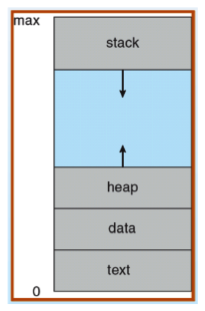
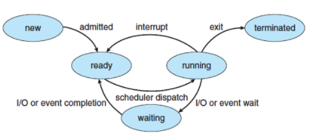
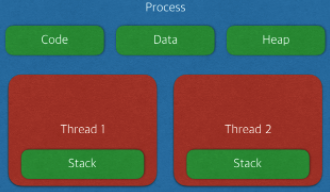
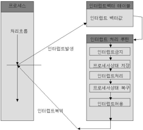

# 프로세스와 스레드의 차이

- 프로세스
    - 현재 실행 중인 프로그램
    - 메모리 위에 적재되어 cpu의 할당을 받을 수 있다.
    - 동적 메모리인 힙을 할당받을 수 있다.
    - 프로세스의 구조
        
        
        
        - text(code): 일반적인 코드
        - data: 변수 및 초기화된 데이터
        - stack: 임시 데이터(함수 호출 및 로컬 변수 등)
        - heap: 코드 내에서 동적으로 생성되는 데이터
    - 프로세스는 다른 프로세스의 자원에 접근할 수 없다.
    - 역할에 따른 구분
        - 사용자 프로세스
            - 사용자 코드를 수행하는 프로세스
        - 커널 프로세스
            - 모든 메모리와 프로세스의 명령에 액세스할 수 있는 프로세스
            - 실행 순서 제어 및 다른 프로세스의 접근 제어
            - 사용자 프로세스 생성
    - 프로세스의 상태 변화
        
        
        
        - New: 프로그램이 메인 메모리에 할당
        - Ready: 프로그램 초기화 등 모든 준비를 마친다.
        - Running: Cpu가 프로세스를 실행한다.
        - Waiting: I/O로 인해 잠시 중단하고 다른 작업을 한다.
        - Terminated: 프로세스 종료. 메모리에서도 내려감
    - 프로세스 제어 블록 → PCB
        - 운영체제가 프로세스를 제어하기 위한 상태 정보
        - PCB는 중요한 정보이기 때문에 커널 스택의 처음(메모리)에 위치
        - PCB 정보 리스트
            - 프로세스 식별자: 프로세스 고유 식별자
            - 프로세스 상태: 위 그림처럼 상태를 표시
            - 프로그램 카운터(PC): 프로세스를 실행하는 다음 명령어의 주소
            - Cpu 및 일반 레지스터
            - CPU 스케줄링 정보: 우선 순위, 실행 시각, 점유 시간
            - 메모리 관리 정보: 프로세스의 주소 공간
            - 프로세스 계정 정보: 페이지 테이블, 스케줄링 큐 등
            - 입출력 상태 정보: 할당된 입출력 장치, 열린 파일 목록

- I/O 시스템(입출력 시스템)
    
    데이터 송수신 방법
    
    - 폴링
        - Cpu가 계속 해서 입 출력 장치를 확인해야 함
        - 버퍼를 지속적으로 확인하기 때문에 비효율적이다. 다른 작업을 수행하지 못함.
    - 인터럽트
        - Cpu가 처리 중일때 입출력 장치나 예외 상황 발생 시에 cpu를 불러 처리
        - 비동기 방식같은 느낌
        - 입출력 연산은 cpu 명령 수행 속도보다 느리기 때문에 인터럽트를 사용
        - 인터럽트 과정
            
            
            
            - A 프로세스가 system call을 통해 인터럽트를 발생시킨다.
            - cpu는 현재 상태를 A 프로세스의 PCB에 저장한다.
            - PC(Program Counter)에 다음에 실행할 명령의 주소를 저장한다.
            - 인터럽트 벡터를 읽고 ISR 주소 값을 가지고 ISR(Interrupt Service Routine)으로 가서 인터럽트 처리 루틴을 실행시킨다.
            - 처리가 끝나면 레지스터를 복구하고 인터럽트를 해제한다.
            - PC를 통해 이전 실행 위치로 복원한다.
    - DMA(Direct Memory Access)
        - 고속 장치에 들어오는 CPU에게 부담이 된다.
        - 장치와 메모리 사이의 cpu 개입을 막고 컨트롤러가 직접 데이터 전송 맡는다.

- 스레드
    
    
    
    - 프로세스 내에서 실행되는 여러 흐름의 단위
    - code, data, heap을 공유하고 stack만 따로 할당받는다.
    - 스레드는 같은 힙을 공유한다.
    - 스택을 스레드마다 독립적으로 할당하는 이유
        - 스택은 함수 호출 시 파라미터, 주소 값, 변수 등이 저장되는 공간이다. 따라서 스레드의 독립 실행을 보장하기 위해 스택만 독립적으로 할당.
    - PC Register를 스레드마다 독립적으로 할당하는 이유
        - PC는 스레드가 어디까지 수행했는지 나타낸다. 다른 스레드의 힙 데이터 사용으로 인한 인터럽트 시 인터럽트가 되어야 하기 때문에 각 스레드마다의 PC를 저장할 필요가 있다.
    - 자바에서의 스레드
        - JVM(자바 가상 머신)이 운영체제의 역할을 한다.
        - 자바는 프로세스가 없으며 스레드만 존재한다.
        - JVM에 의해 스케줄링되는 실행 단위 코드 블록이다.
- 결론
    - 프로세스는 운영체제로부터 자원을 할당받는 작업의 단위
    - 스레드는 프로세스가 할당받은 자원을 이용하는 실행의 단위
