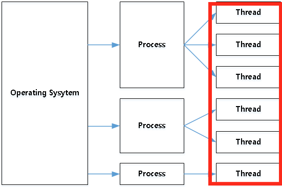

# 사용자 수준 스레드와 커널 수준 스레드

담당자: 심영석
상태: 운영체제
속성: 2022년 2월 25일 오후 3:03

- 쓰레드는 뭐니?
    - 프로세스 내 작업의 단위를 말함
    - 하나가 될 수도 있고, 여러개(멀티쓰레드)가 될 수도 있음!
    
    
    

- 커널은 뭐니?
    - 컴퓨터와 전원을 켜면 운영체제는 이와 동시에 수행된다. 또한, 소프트웨어가 컴퓨터 시스템에서 수행되기 위해서는 메모리에 그 프로그램이 올라가 있어야 한다. 마찬가지로 운영체제 자체도 소프트웨어이기 때문에 전원이 켜짐과 동시에 메모리에 올라가야 한다.
    - 하지만, 운영체제처럼 규모가 큰 프로그램이 모두 메모리에 올라간다면 한정된 메모리 공간의 낭비가 심함 → 따라서 운영체제 중 **항상 필요한 부분**만을 전원이 켜짐과 동시에 메모리에 올려놓고 그렇지 않은 부분은 필요할 때 메모리에 올려서 사용하게 된다.
    - 이 때 **메모리에 상주하는 운영체제의 부분을 커널**이라 한다. 또 이것을 좁은 의미의 운영체제라고도 한다. 즉 커널은 메모리에 상주하는 부분으로써 운영체제의 핵심적인 부분을 뜻한다. 이에 반에 넓은 의미의 운영체제는 커널뿐 아니라 각종 시스템을 위한 유틸리티들을 광범위하게 포함하는 개념이다. (보통은 운영체제라고 하면 커널을 말하게 된다.)
    
- 메모리 영역 = 유저 영역 + 커널 영역
    - 유저 영역 : 사용자에 의해서 할당되는 메모리 공간
    - 커널 영역 : 소프트웨어를 실행시키기 위해 필요한 메모리 공간
    - 사용자는 유저 영역을 당연히 사용하지만, 안정성 제공 측면에서 커널 모드와 유저 모드가 사용된다.
    - 기본은 유저 모드로 동작 → 커널이 실행되어야 하는 경우에 커널 모드로의 전환이 이루어진다. → 이러한 모드의 전환은 시스템에 부담을 준다.
    - 유저 모드에서 동작할 때 커널 영역으로의 접근이 금지된다. 단, 커널 모드에선 모든 영역으로 접근이 가능하다.
    - 이러한 두 가지 모드를 제공하는 친구는 운영체제가 아니라 프로세스다. 따라서, 메모리 보호 기능이 CPU에 달려있다.
    
- 커널 레벨 쓰레드 vs 유저 레벨 쓰레드
    - 생성 주체가 누구인가에 따라 구분된다.
    - 프로그래머 요청에 따라 쓰레드를 생성하고, 스케쥴링의 주체가 커널이면 → 커널 레벨 쓰레드
    - 커널이 모델을 지원하지 않거나, 제공하는 쓰레드 모델이 별로일 때 → 커널에 의존적이지 않은 형태로 쓰레드를 제공하는 라이브러리를 활용하는 방식 → 유저 레벨 쓰레드
    - 입출력 인터럽트가 발생하면 커널은 '사용자 모드'가 되어서 사용자 수준 스레드의 응답을 기다린다. 사용자 수준 스레드의 응답이 오면 다시 '커널 모드'로 변환되어 이어서 커널 스레드가 일 처리를 하게 되는 것이다.
    
- 장/단점
    - 커널 레벨 쓰레드의 장점은 커널이 직접 제공해 주기 때문에 안정성과 다양한 기능이 제공된다.
    - 커널 레벨 쓰레드의 단점은 유저 모드에서 커널 모드로의 전환이 빈번하게 이뤄져 성능 저하가 발생한다.
    - 유저 레벨 쓰레드의 장점은 커널은 쓰레드의 존재조차 모르기 때문에 모드 간의 전환이 없고 성능 이득이 발생한다.
    - 유저 레벨 쓰레드의 단점은 하나의 스레드가 커널에 의해 블로킹 되면 프로세스 전체가 블로킹되고,이를 해결하려면 프로그래밍이 어려워지고 커널 레벨 쓰레드에 비해 결과 예측이 어려워진다.
