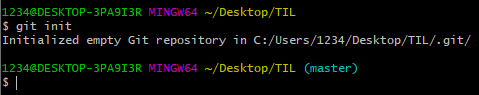

# Git Command

> Git 명령어 정리

## 초기설정

### 0. init

* `git init`
* `.git/`폴더를 생성해준다.

* `.git`폴더가 생성된 경우 오른쪽에 master 라는 표시가 나온다.
* 최초에 한 번만 하면 된다.

### 1. config

* `git config --global user.email "myemail@gmail.com"`
  * email의 경우 깃헙에 올릴경우 잔디가 심어지는 기준이므로 정확하게 입력해야 한다.
* `git config --global user.name "myname"`
* 최초에 한 번만 하면 된다.

## 커밋기록

### 1. add

* `git add <추가하고 싶은 파일>`
  * `git add . ` : 현재 폴더의 모든 파일과 폴더를 add
* Working directory에서 staging area로 파일 이동

### 2. commit

* `git commit -m "메세지"`
  * 메세지는 필수로 적어야 한다.
  * 메세지에 들어가는 내용은 기능 단위로 적어주는 것이 좋다. (예. 로그인 페이지 완성, 로고 입력 완성)
* 스냅샷을 찍는 동작
* add 되어있는 파일들을 하나의 묶음으로 저장

### 3. remote

* `git remote add origin <주소>`
* 원격 저장소와 현재 로컬 저장소를 연결하는 명령어
* 한번만 진행한다.

### 4. push

* `git push origin master`
* git아 올려줘 origin으로 master를
* 원격저장소에 로컬 저장소의 데이터를 전송

## 상태확인

### 1. status

* `git status`
* 현재 git 상태를 출력

### 2. log

* `git log`
* commit 기록을 전체 출력
* 옵션
  * `--oneline`: author, date 같은 정보를 제외하고 한 줄로 출력
  * `--graph`: Commit들을 점으로 표현하고 그 커밋을 선으로 연결해서 그래프 형태로 출력

### 3. diff

* `git diff`
* 현재 변경사항을 체크(git add 하기 전에 체크)

## 추가파일

### 1. gitignore

* .**gitignore** 이란? .**gitignore** 파일이란 **Git** 버전 관리에서 제외할 파일 목록을 지정하는 파일 이다. **git**으로 프로젝트를 관리할 때, 그 프로젝트 안의 특정파일들은 관리할 필요가 없는 경우가 있다.

* `.gitignore`:파일을 생성 후 git으로 관리하고 싶지 않은 파일들을 저장
* gitignore.io 사이트에서 하면 편함

## Branch

### 1. 생성

* `git branch <브랜치이름>`

### 2. 이동

* `git switch <브랜치이름>` : 최신 문법
* `git checkout <브랜치이름>` : 예전 문법

### 3. 삭제

* `git branch -d <브랜치이름>`

### 4. 병합

* `git merge <브랜치이름>`
* base가 되는 branch로 이동해서 명령어 사용 
  * feature를 master로 merge하고 싶다면 master 상태에서 merge 진행
* 충돌이 발생한 경우 => 충돌을 해결하고 다시 add, commit, push

## VS 명령어

* `ctrl + shift + p` : 소스 열기